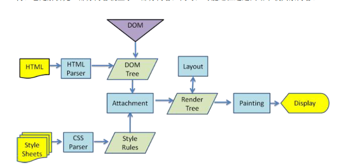

# 虚拟DOM
React实现了一套独立于浏览器的事件系统和DOM树（虚拟DOM）,也就是用javascript对象表示树的结构来模拟维持一个DOM树。  
这么干有什么好处呢？在我们之前的很多UI框架里，如果我们对UI进行更新，是将旧的DOM移除，然后构建新的DOM并插入。而在浏览器里是要经过几道工序的（如下图），所以很慢，更别说大量的操作dom。  
  
而react的虚拟dom通过自己的diff算法，构建一颗新的dom树，然后去对比这两颗树的差异，把得到的差异应用到真正的dom树上，页面就更新了。而且这个虚拟dom有着自己的事件系统，和浏览器事件一样，不过性能和跨浏览器性更好。
# diff算法 复杂度O(n)
在react中，相同的组件会拥有相似的树结构，不同的组件则拥有不同的树结构。  
## 节点比较
在两颗树进行比较时，首先比较的是两个节点，会有以下几种情况。
### 节点类型不同
何谓节点类型不同，比如一个是div，另一个是p。如果react发现前后两棵树某处节点类型不同，**他会直接移除前者，然后插入新的节点。如果子节点，也会一并移除，撤点销毁。** 不会浪费时间继续比较。
### 节点类型相同  
如果两个节点类型相同，则比较他们的熟悉，在虚拟DOM中，属性是由键值对组成的。如果属性发生了更改，则react会直接对其键所对应的值进行重设。
## 组件比较
在react中，组件比较的逻辑是和节点比较一样。
## 逐级比较
在两颗树上的同一处的相同类型节点比较后，会递归的进行子级的比较。
## 列表节点比较
假如说有一个div里包含了节点a, b, c , d, e。而新的div节点里是节点a，c，b，e，f。也就是调换了b和c的位置，移除了e，增加了f。这里的话有很多操作方式，但是要尽可能找到优化的操作方案。  
react里在dom树里，可以给每个子级都有一个键值，用来进行比较。如果指定了一个键值，React 就能够检测出节点插入、移除和替换，并且借助哈希表使节点移动复杂度为 O(n)。对于列表节点提供唯一的key属性可以帮助React定位到正确的节点进行比较，从而大幅减少DOM操作次数，提高了性能。  
在react中，键对于兄弟节点是唯一的，而对于整个树来说不唯一。
## 应用于真正的DOM树  
react会将两棵树的所有差异记录在一个patch中，然后将这个patch应用到浏览器里的DOM树中。
